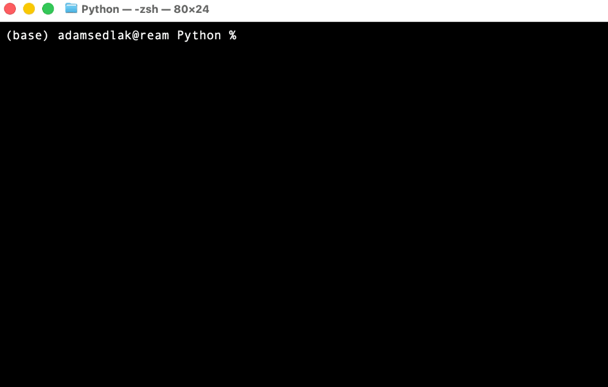

# :zap:sting:zap:

Welcome! This repository contains STING—**S**pecialized **T**ool for **IN**verter-based **G**rids. STING is an open-source software that is able to run:

- AC Power Flow
- Stochastic capacity expansion
- Kron reduction
- Model order reduction
- Small-signal modeling
- Electromagnetic transient simulation


## Minimum requirements to run STING

> Please install Python 3.14

We are actively working to support STING in the latest version of Python.

> Please install all relevant solvers for your use case before running STING.

Most of modules additionally require solvers that solve optimization models. For example, solving optimal power flow is needed to find an equilibrium point for small-signal modeling. We currently support and use the following libraries:

| Solver | How to install        | Use                                          |
|--------|-----------------------|----------------------------------------------|
| IPOPT  | `brew install ipopt`  | ACOPF, Small signal modeling, EMT simulation |
| Gurobi | `pip install gurobipy`| Capacity expansion                           |
| MOSEK  | `pip install mosek`   | Capacity expansion                           |


## Install STING 
STING is available on PyPI (https://pypi.org/project/sting-py/)! 

> [!WARNING]  
> STING has been packaged in PyPI under the name `sting-py`.

To install follow the steps:

1. Create a folder where you plan to have your case studies:
```
mkdir sting_env
```
2. Go to the folder:
```
cd sting_env
```
3. Create a python environment:
```
python3.14 -m venv .venv
```
4. Activate the python environment:
```
source .venv/bin/activate
```
5. Install STING in your python environment:
```
pip install sting-py
```
6. Execute an example. This example is the construction of the state-space matrices of the small-signal model of a 9 bus system.
```
sting-example 9_bus_ssm
```

You can also see the prior steps executed in the following video clip. Refresh your browser to repeat the clip.




Alternatively, you can also install STING in Editable Mode directly from this repository. We recommend this installation if you want to get the latest version, develop new models, and explore the framework of the modules.

### Install STING in Editable Mode

1. **Download STING**: Make sure you have [python3.14](https://www.python.org/downloads/release/python-31311/) installed on your computer. Using [`pyenv`](https://github.com/pyenv/pyenv) can be helpful for managing multiple versions of python on your PC. Start by cloning this repository and navigating into the STING directory.
    ```
    git clone https://github.com/REAM-lab/sting
    cd sting
    ```
    Next, create a virtual environment and download all required packages.
    ```
    python3.14 -m venv .venv 
    source .venv/bin/activate
    pip install -e .  
    ```
    To install all optional dependencies, run  `pip install -e ".[all]"`. This will install extra packages necessary for optimization, specifically solvers.

2. **Run sting**: To ensure that sting was installed correctly navigate to the examples folder. You will see examples for different modules. Find the file `run.py` and execute it.

### Installing STING in Project Configuration
For research projects we recommend creating a separate directory for your project files and scripts—isolating them from the source files of STING. To install and configure STING in this manner perform the following steps.
1.  **Download STING**: If you haven't already, install [python3.14] and clone STING
    ```
    git clone https://github.com/REAM-lab/sting
    ```
2. **Project Installation**: In the *same* parent directory of STING, create a new directory for your project—for instance `my_project`. Then install all packages from STING in a virtual environment
    ```
    mkdir my_project
    cd my_project
    python3.14 -m venv .venv 
    source .venv/bin/activate
    pip install -e ../sting/.
    ```
3. **Visual Studio Code (Optional)**: If you are using Visual Studio Code as a text editor you can add STING as an "extra path". To do so go to `Preferences > Settings` and search for extra paths. Under `Python > Analysis: Extra Paths` add the global path of STING on your machine—for instance `Users/your_name/python/sting`.


## Citing
```
@misc{STING,
    author = {{Renewable Energy + Advanced Mathematics Lab (REAM)}},
    title = {Specialized tool for inverter-based grids},
    year = {2025},
    publisher = {GitHub},
    journal = {GitHub repository},
    url = {https://github.com/REAM-lab/sting}
}
```

### Research Software Notice
All work is distributed under the Apache open-source license. However, this repository also contains software developed as part of active research that has not yet been formally published. As a developer, user, or reader of this software you are agreeing to good faith applications of this work. Original research that has not been previously published may not be represented as the independent work of another author. We kindly ask that you adhere to academic integrity and consult with authors if you are unsure what might constitute original unpublished work.