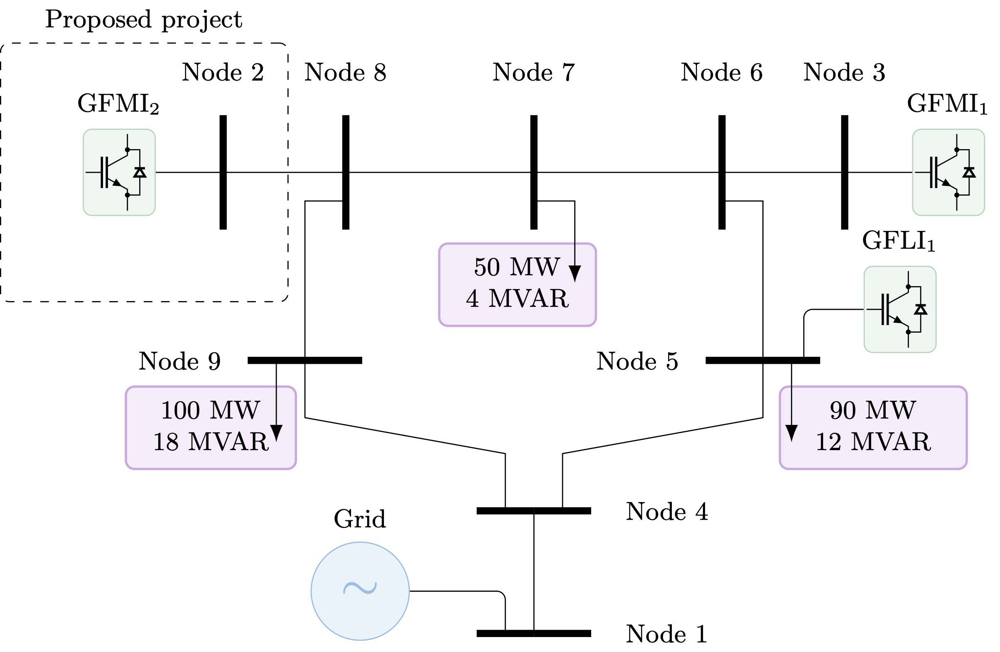
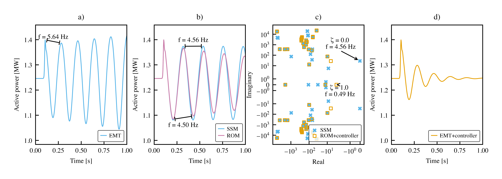

# Tutorial: Model Reduction and Control

In this tutorial we show how STING can be used to construct a reduced-order model of the Western System Coordinating Council (WSCC) 9 bus test system. Using this reduced model we will then construct an output feedback controller to stabilize a problematic grid forming inverter. Finally, we validate that the controller is working properly via electromagnetic transient (EMT) simulation.


## Background


**Fig 1**: Modified WSCC $230$-kV $9$-bus system.

**The problem:** The setting of this tutorial is a hypothetical interconnection study in the WSCC $230$-kV $9$-bus test system (Fig. 1). A utility is proposing to add a grid forming inverter (GFMI $_2$) and a transmission line to the grid. The utility provides the independent system operator (ISO) with a detailed model of the proposed project that can be used in EMT simulation. Using this model, the ISO determines that if interconnected the new inverter could cause grid instabilities. The ISO concludes that, as is, the proposed project should not be added to the grid. The utility is now tasked with redesigning the control mechanisms of their inverter.

This task however presents a challenge. The developer plans to construct a stabilizing output feedback controller for the inverter. To ensure that the inverter behaves properly when added to the grid, the developer would like to use a model of external grid's dynamics in their controller. While the ISO has a complete model of the system they cannot share it with the developer due to intellectual property concerns []. 


**Proposed solution:** The following pipeline is proposed to solve the described scenario:

1. To address the privacy concerns and reduce model complexity, the ISO constructs a reduced-order model of the system in Fig. 1, excluding proposed project. This reduced-order model is given to the interconnecting party.
2. The interconnecting party designs an output feedback controller for the proposed GFMI$_{2}$ using the reduced-order model. They study the stability of the closed-loop system, including synthesized controller, through eigenvalue analysis.
3. The interconnecting party then provides the ISO with an EMT model of the improved GFMI$_{2}$ with the output feedback controller. The ISO verifies the stability of the system with the proposed project through EMT simulation, using the full-order model of the grid.

Now we will implement this pipeline in STING!

## Installation
1. To run this tutorial the following files: `run.py`, `wscc9.py`, `control_design.py`, and `plots.py`. To download with `git` navigate simply run:
    ```
    git clone https://github.com/REAM-lab/STING.git
    ```
    and navigate to `tutorials` > `model_reduction_and_control`.
2. In the directory where you downloaded the `.py` scripts, create and activate a virtual environment:
    ```
    python -m venv .venv 
    source .venv/bin/activate
    ```
3. Install all package dependencies:
    ```
    pip install sting-py cmas control
    ```

## Walk Through

Next we will walk through the code in `run.py` line-by-line. Feel free to execute `run.py` in advance and explore the associated code or outputs.

### Constructing a System Model

After setting up each of the output directories we are calling: 
```python
system = wscc_9(case_directory=cwd)
```
This constructs a the WSCC 9 bus system by calling a helper function in `wscc_9.py`. If we look inside this script we first create the bus, line, generator components in STING. For instance, the following code creates a grid following inverter (GFLI $_1$) at bus 5. 
```python
gfli_1 = GFLI16A(
        name="gfli_1", bus="bus_5", zone="external",
        # Power flow 
        minimum_active_power_MW=50, maximum_active_power_MW=100, 
        minimum_reactive_power_MVAR=-100, maximum_reactive_power_MVAR=100,
        cost_variable_USDperMWh=10, base_power_MVA=100, base_voltage_kV=0.48, 
        base_frequency_Hz=60,
        # LCL filter
        rf1_pu=0.002, xf1_pu=0.07, csh_pu=0.01, rsh_pu=100, 
        txr_power_MVA=100, txr_voltage1_kV=0.48, txr_voltage2_kV=230, 
        txr_r1_pu=0.003/2, txr_x1_pu=0.08/2, txr_r2_pu=0.003/2, 
        txr_x2_pu=0.08/2, 
        # Phase-locked loop (PLL)
        kp_pll_rad_s=100, ki_pll_rad2_s2=2500, tau_pll_s=1/100,
        # Inner current controller
        kp_cc_pu=0.05, ki_cc_puHz=0.6, kff_cc=0.75,
        # Power controllers
        kp_pc_pu=0.1, ki_pc_puHz=100
    )
```

After constructing all components we create a `System` object. This serves as a container for all components so that we can access them later.
```python
system = System(case_directory=case_directory)

for component in buses + timepoints + loads + lines + generators:
    system.add(component)

system.apply("post_system_init", system)
```

### Building a Small-Signal Model
For control applications and analysis it is typically of interest to have a small-signal model. That is, the matrices $A$, $B$, $C$, $D$, such that

$$\tfrac{d}{dt}{\Delta x} = A \Delta x + B \Delta u$$
$$\Delta y = C \Delta x + D\Delta u$$


Building a small-signal model in STING is very easy! We simply execute the following line of code:
```python
system, ssm = main.run_ssm(system=system)
```

Internally STING will perform the following operations:
1. Solve AC power flow to find a steady-state equilibrium point, about which to linearize.
2. Each component internally computes its initial conditions and small-signal model using the power flow solution.
3. All of the of the component-level small-signal models are interconnected using the Component Connection Method [[DS81](#DS81)] to form a system-level small-signal model.

For more information on this process see [[[SSH26](#SSH26)]].

> [!NOTE]
> The Component Connection Method circumvents the need to for automatic differentiation and computing a Jacobian to obtain a small-signal model.

Next we simulate the response of the small-signal model using the following.
```python
ssm.simulate_ssm(inputs=inputs, t_max=t_max, output_directory=dir_ssm)
```
Here `inputs` is a nested set of dictionaries containing functions. Each function is used to specify the input, above or below nominal value, to a given component at time $t$. For instance,
```python
step = make_smooth_step(step_time=0.1, initial_value=0.0, final_value=0.10, transient_width=5e-3)
inputs = {'gfmi_18a_0': {'v_ref': step}}
```
applies a $0.1$ per unit step change in the voltage setpoint of GFLI $_2$ Internally STING integrates the differential equations using `scipy.integrate.solve_ivp` and writes `.csv` and interactive `.html` plots to the specified outputs folder.

### Model Reduction

Model reduction can be used to construct an approximate representation of a small-signal model with fewer states. For instance, we may hypothesize that the states $x \in \mathbb{R}^n$ can be reasonably approximated by some lower-order state vector $x_r \in \mathbb{R}^r$, where $r < n$. Stated equivalently, there exists a matrix $V \in \mathbb{R}^{n \times r}$ such that $x \approx V x_r$. If we can identify such a $V$ and its left inverse $W^\top$, such that $W^\top V = I_r$, we can *project* our state-space model into a lower dimension via

$$A_r = W^\top A V \quad \quad B_r = W^\top B$$
$$C_r =C V \quad \quad D_r = D$$


In this tutorial we will create a reduced order model of all components in the zone labeled  `"external"`. You can refer to `wscc_9.py` to see which components we labeled with `zone="external"` when they were instantiated. After constructing a reduced-order model we will interconnect it will the full-order model of all components in the proposed project. In this manner we are essentially creating a dynamic circuit equivalent model of the grid excluding the project. 

Here we will apply balanced truncation to removing the states that are both hard to control and observe. In code we assign a `BalancedTruncation` object to the `"external"` zone, specifying that the resulting model should have $33$ states.
```python
balanced_truncation = {
    "external": BalancedTruncation(r=33, method="truncate")
    }
rom = main.run_model_reduction(ssm=ssm, reductions=balanced_truncation)
```
Internally, STING will resolve which components should be reduced, based on their zone, and construct the projection matrices $V$ and $W$. For more information on this process see [[SSH27](#SSH27)].

Next we report some of the properties of the resulting reduced-order model using the python `control` library.
```python
# Compute statistics of the ROM and FOM
external_grid = rom.system.linear_subsystems[0]
ss_fom = ct.ss(*external_grid.full_order_model.data)
ss_rom = ct.ss(*external_grid.reduced_order_model.data)
print("Full-order model has", ss_fom.nstates, "states")
print("Reduced-order model (without proposed project) ", ss_rom.nstates, "states")
print("H_2 Error", round(100 * ct.norm(ss_fom - ss_rom,p=2) / ct.norm(ss_fom, p=2),3), "%")
print("Max eigenvalue of the ROM + study area: ", np.max(np.linalg.eigvals(rom.model.A).real))
```
In particular the $\mathcal{H}_2$ relative error, aims to capture the extent to which the dynamic response of the reduced-order model differs from the full-order model. 

Finally, we simulate the response of the reduced-order model when subjected to the same inputs.

### Control Design
Using the state-space model of the reduced-order model and proposed project we will design a output feedback controller. STING does not have a built in control synthesis module so we will import one from our prior work. If we look inside `control_design.py` we see the following code

```python
def construct_controller(rom:SmallSignalModel):

    A_c = rom.model.A
    B_c = rom.model.B[:, 0:1] # take only p_ref

    C_c = np.zeros((5, A_c.shape[0]))
    C_c[0, 1] = 1 # w_pc
    C_c[1, 7] = 1 # i_vsc_d
    C_c[2, 8] = 1 # i_vsc_q
    C_c[3, 9] = 1 # i_bus_d
    C_c[4, 10] = 1 # i_bus_q 

    D_c = np.zeros((C_c.shape[0], B_c.shape[1]))

    Q = 10**4*np.eye(A_c.shape[0])
    R = 10**6*np.eye(B_c.shape[1])

    solve_settings = {'solver': cp.CLARABEL, 'verbose': False}

    # Solve CARE to obtain P
    P = solve_continuous_are(A_c, B_c, Q, R)

    # Use MAS output feedback
    alpha_coef = 100
    beta_coef = 0
    gamma_coef = 0
    mas_out = mas_output_feedback(A_c, [B_c], [C_c], [D_c], [Q], [R], [P], alpha_coef, beta_coef, gamma_coef, **solve_settings)

    # Print dominant eigenvalues of the closed-loop system
    eigenvalues = eigvals(mas_out.Acl_F)
    dominant_eigenvalue = eigenvalues[np.argmax(eigenvalues.real)]
    print("Dominant eigenvalues of the closed-loop system: ", dominant_eigenvalue)

    # Save closed-loop a matrix as csv file
    Acl_F = mas_out.Acl_F
    pl.DataFrame(Acl_F).write_csv(os.path.join(cwd, "outputs", "closed_loop_A.csv"))
```

First we specify which inputs and outputs are controller will utilize. Then we design the matrices $Q$ and $R$ for LQR control synthesis and compute a controller using `cmas`, Control of Multi-Agent Systems [[SH26](#SH26)]. After obtaining a controller $F$ we will place it in closed-loop simulation by defining the following function

```python
    # Initial conditions in the LCL filter
    x0 = rom.system.gfmi_18a[0].lcl_filter.emt_init

    def output_feedback_control(t: float, x: np.ndarray, id: dict):

        F = mas_out.F[0]
        w0 = 1
        i_vsc_d0 = x0.i_vsc_d
        i_vsc_q0 = x0.i_vsc_q
        i_bus_d0 = x0.i_bus_d
        i_bus_q0 = x0.i_bus_q

        i_vsc_d, i_vsc_q, _ = abc2dq0(x[id['gfmi_18a_0']['i_vsc_a']], x[id['gfmi_18a_0']['i_vsc_b']], x[id['gfmi_18a_0']['i_vsc_c']], x[id['gfmi_18a_0']['angle']])
        i_bus_d, i_bus_q, _ = abc2dq0(x[id['gfmi_18a_0']['i_bus_a']], x[id['gfmi_18a_0']['i_bus_b']], x[id['gfmi_18a_0']['i_bus_c']], x[id['gfmi_18a_0']['angle']])

        delta_y = np.array([x[id['gfmi_18a_0']['w']] - w0, 
                            i_vsc_d - i_vsc_d0, 
                            i_vsc_q - i_vsc_q0, 
                            i_bus_d - i_bus_d0, 
                            i_bus_q - i_bus_q0])
        delta_u = F @ delta_y

        return delta_u[0]
```
In simulation this function accesses the currents in the LCL filter ($i^\text{vsc}_{dq}$ and $i^\text{bus}_{dq}$) and the angular velocity ($\omega$) of GFMI $_2$ and compute the appropriate control response the in the inverters power setpoint ($p^\text{set}$). That is

$$ \Delta p^{\text{set}} = F [\Delta\omega \quad \Delta i^\text{vsc}_d \quad \Delta i^\text{vsc}_q \quad \Delta i^\text{bus}_d \quad \Delta i^\text{bus}_q]^\top$$

Finally, to place this controller in closed loop we need to create a new nested dictionary for simulation inputs. This is done via the following line in `run.py`:

```python
controller = {'gfmi_18a_0': {'v_ref': step, 'p_ref': output_feedback_control}}
```

### Results
Now we will validate that the controller is working as intended by using the full-order nonlinear EMT model. That is
```python
main.run_emt(system=system, inputs=controller, t_max=t_max, output_directory=dir_with_ctr)
```
Note that now `inputs=controller` so the dynamic response to the same step input will be different. After running `run.py` you can now run `plots.py` to obtain the following figure



**Fig. 2**: a) Active power injected by GFMI $_2$ obtained from EMT simulation, b) Active power injected by GFMI $_2$ obtained from system-level small-signal state-space model (SSM) and reduced order model (ROM), c) Eigenvalues of the system-level SSM and ROM with output feedback controller, d) Active power injected by GFMI $_2$ with output feedback controller obtained from EMT simulation. Reading the panels from left to right reveals the described pipeline of `run.py`.

## References

<a id="DS81"></a>[DS81] R. DeCarlo and R. Saeks, *Interconnected Dynamical Systems*. New York
Dekker, 1981.


<a id="SH26"></a> [SH26] P. Serna-Torre and P. Hidalgo-Gonzalez, “Static output feedback control for multi-agent systems using nash equilibrium,” Under review, 2026.

<a id="SSH26"></a>[SSH26] P. Serna-Torre, A. Sedlak, and P. Hidalgo-Gonzalez. "A generalized and open-source state-space framework to derive small-signal models for EMT dynamics of inverter-dominated grids", *TechRxiv*, 2026.

<a id="SSH27"></a>[SSH27] A. Sedlak, P. Serna-Torre, and P. Hidalgo-Gonzalez, “Model reduction of electromagnetic transient dynamics for inverter-based grids: an interconnected systems framework,” *Electric Power Systems Research*, vol. 262, p. 113671, 2027. [Online]. Available: https://www.sciencedirect.com/science/article/pii/S0378779626009648.